<picture>
  
</picture>

# Rotom Bot
The official server management bot for the Discord server <a href="https://discord.gg/7FBupspBZB"> The Pokehub</a> written in Python using the discord.py wrapper.
</br></br>


# Bot features
## Tournament registration
Rotom Bot offers an in-house tournament registration system for <a href="https://pokemonshowdown.com/"> Pokemon Showdown</a>-based tournaments 
which is connected to the <a href="https://github.com/smogon/pokemon-showdown-client/blob/master/WEB-API.md">Showdown API</a> for verification of users and battle replays. 

Registering for a tournament in the registration channel ```<@member> <Showdown ID>``` </br>
<picture>
  
</picture>
  
Displaying a list of tournament participants ```.participants``` </br>
<picture>
  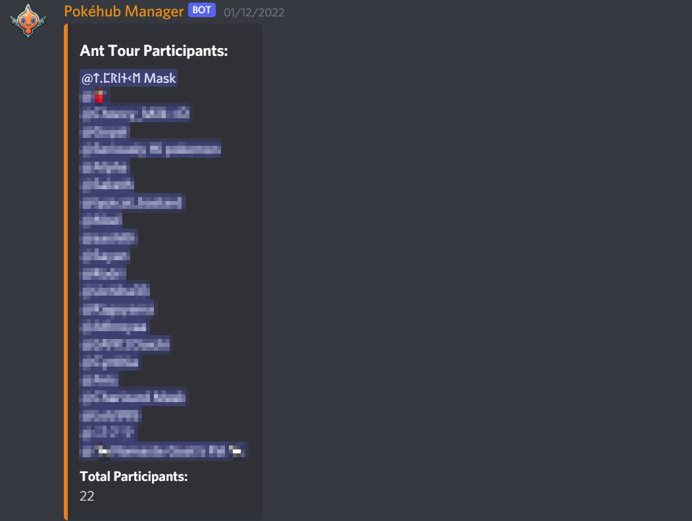
</picture>
  
Announcement of battle replay results dynamically </br>
<picture>
  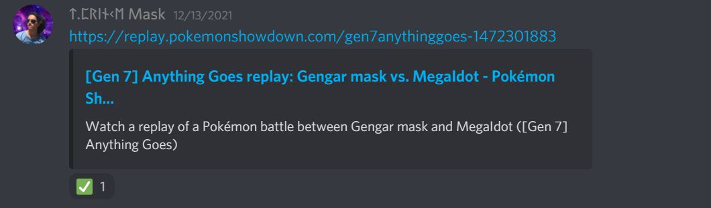
</picture>
  <picture>
  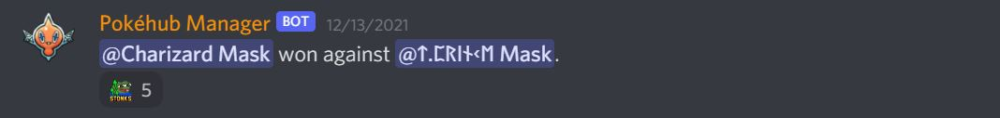
</picture>


## League management
The server hosts Pokemon league-style tournaments/events annually in which most, if not all components of the tournament are handled by Rotom Bot itself.

Display registered pool of challenger ```.pl <gen>``` or elite ```.epl <gen>``` </br>
<picture>
  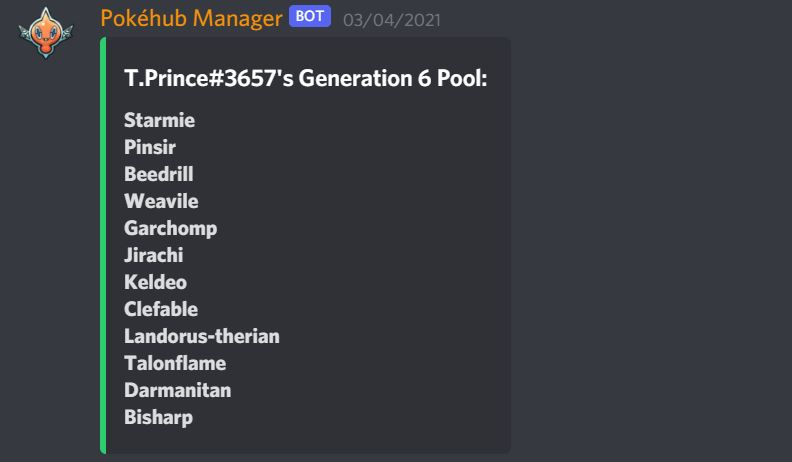
</picture>
  <picture>
  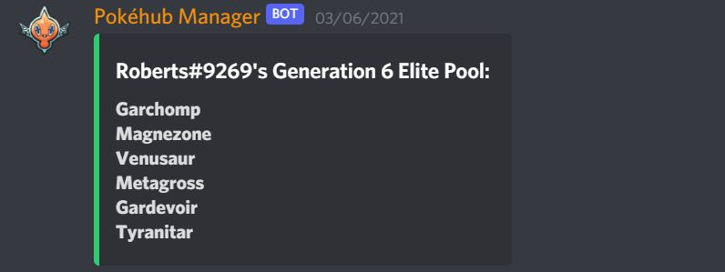
</picture>

Display profile of normal participant (challenger, gym leader, elite) ```.p <gen>``` </br>
<picture>
  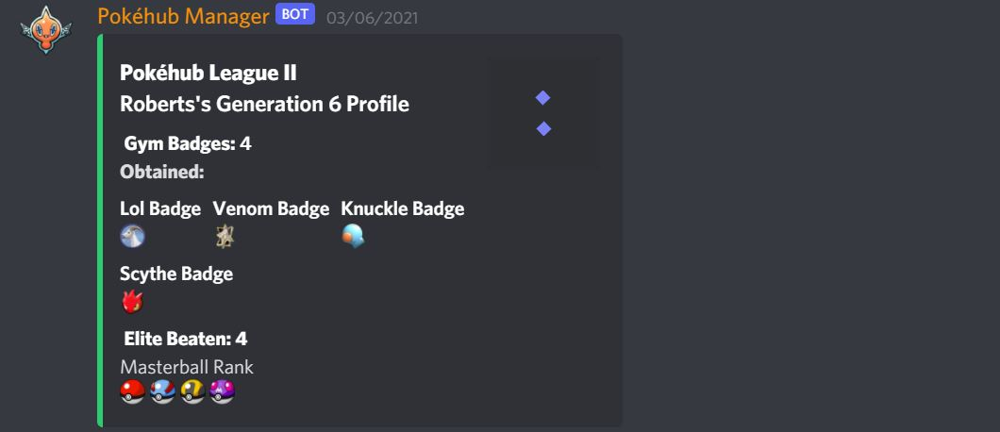
</picture>

Display profile of current champion  ```.champion``` </br>
  <picture>
  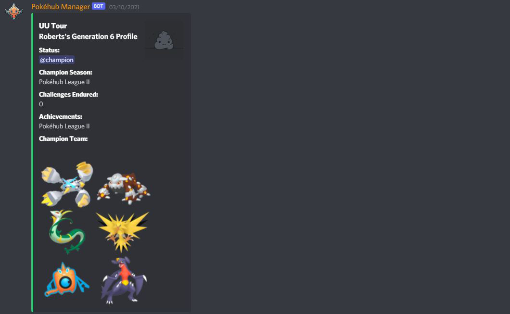
</picture>


## Role management for teams
Rotom Bot offers a role management system for "Villain Teams" based on the main Pokemon games. 
Members can freely join teams via Rotom Bot commands to access secret team chats with a 24-hour limit.

Select a desired team from the given choices  ```.jt``` </br>
<picture>
  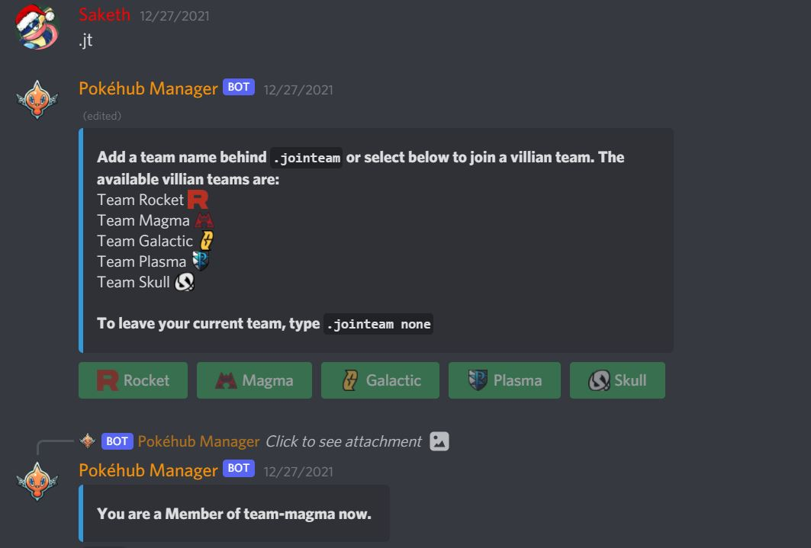
</picture>

Directly join a team ```.jt <Team>``` </br>
<picture>
  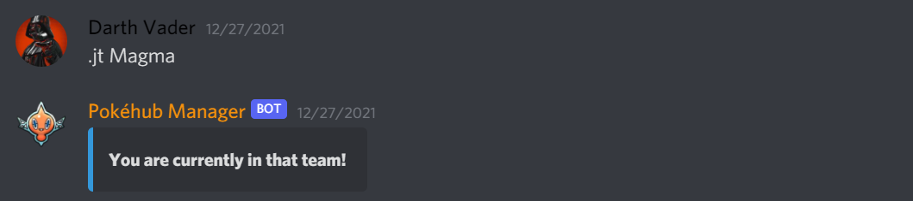
</picture>

Leave your current team ```.jt None``` </br>
<picture>
  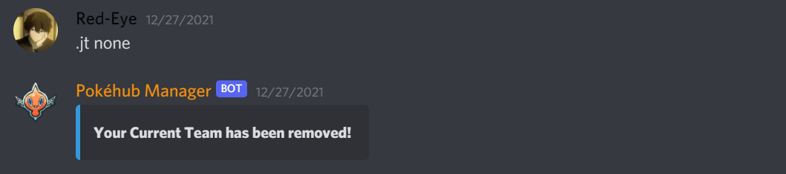
</picture>

Bot restricts member from switching teams if they have just switched teams recently within 24 hours
<picture>
  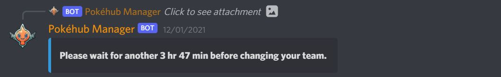
</picture>


## Profanity filter
Messages sent in server is filtered through a profanity filter based on <a href="https://github.com/snguyenthanh/better_profanity">better_profanity</a>
to introduce a Discord Pokemon community suitable for all ages. 

Disallowed messages are deleted by the bot immediately </br>
<picture>
  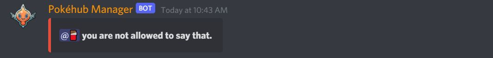
</picture>

Deleted messages are logged in a moderator channel </br>
<picture>
  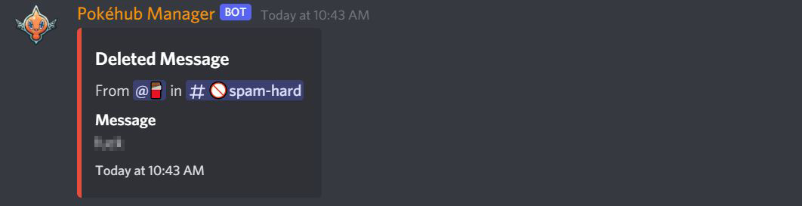
</picture>


## Text translation
Rotom Bot offers a text translation feature, which comes in handy in case someone sent a non-English message in chat. 
Based on <a href="https://github.com/ssut/py-googletrans">Googletrans</a> with some slight modifications.

Text translation with auto-detect language ```.t <text to be translated>``` </br>
<picture>
  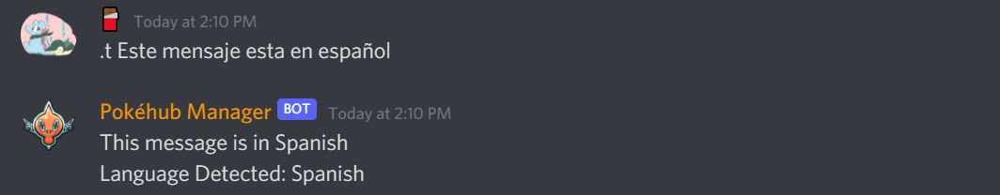
</picture>

Text translation with input-output languages defined ```.t <text to be translated> --<input lang> --<output lang>``` </br>
<picture>
  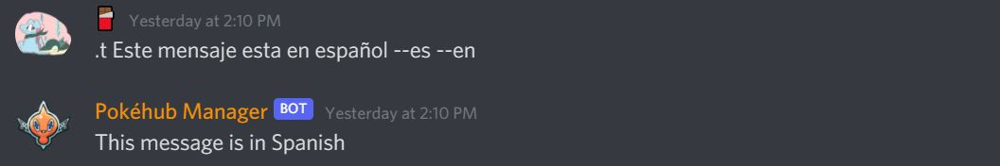
</picture>


## Urban Dictionary and English Dictionary feature
Rotom Bot offers lookup of text on the Urban Dictionary via <a href="https://rapidapi.com/community/api/urban-dictionary">Urban Dictionary API on RapidAPI</a> and English dictionaries via <a href="https://github.com/geekpradd/PyDictionary">PyDictionary</a>

Text lookup on Urban Dictionary ```.urban <text to be searched>``` </br>
<picture>
  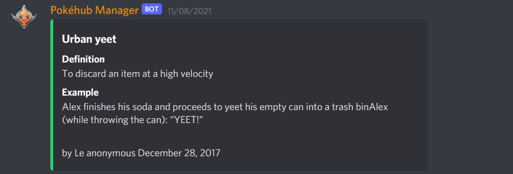
</picture>

Text lookup on an English Dictionary ```.dict <text to be searched>``` </br>
<picture>
  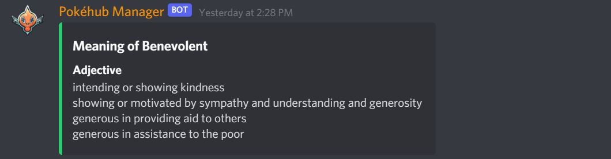
</picture>


## Snipe and edit snipe feature
Rotom Bot offers snipe (recover the previous message deleted) and esnipe (recover the previous message edited) features which works for messages modified within the last 60 seconds. These features are mainly for some conversational fun in the server.

Snipe message ```.snipe``` </br>
<picture>
  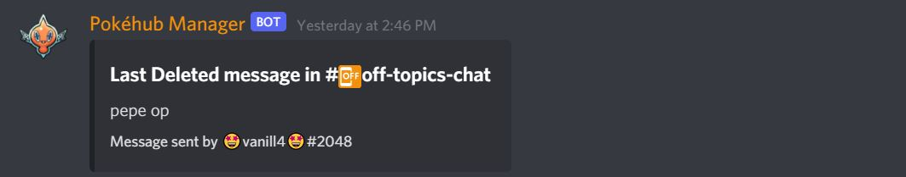
</picture>

Edit snipe message ```.es``` </br>
<picture>
  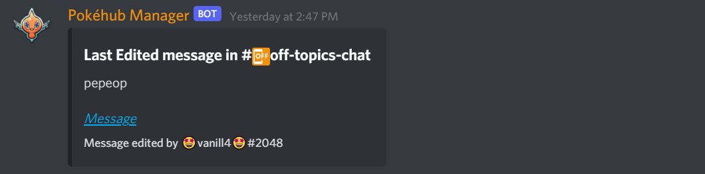
</picture>


## Games section
Rotom Bot offers a game section which includes a few message-based games. Nobody really plays them nowadays though :( , 
but they were an interesting learning experience for the dev.

Guess The Number ```.gg``` </br>
<picture>
  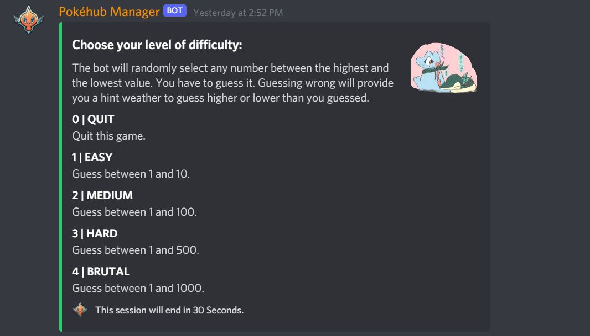
</picture>

Tic-Tac-Toe (implemented this one with a minimax algorithm) ```.ttt``` </br>
<picture>
  
</picture>

Rock-Paper-Scissors ```.rps``` </br>
<picture>
  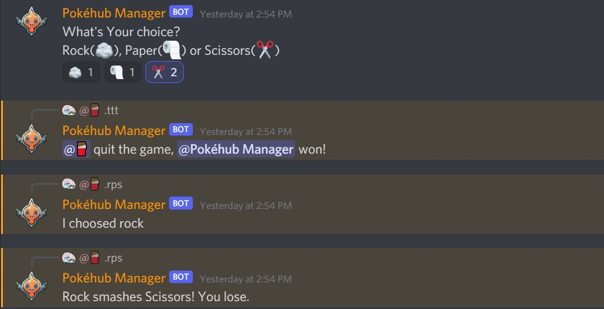
</picture>


## Miscellaneous features
Rotom Bot offers a multitude of other smaller features which are generally quite useful. 

Discord avatar/profile picture of a server member or self ```.av <Member name>(optional)``` </br>
<picture>
  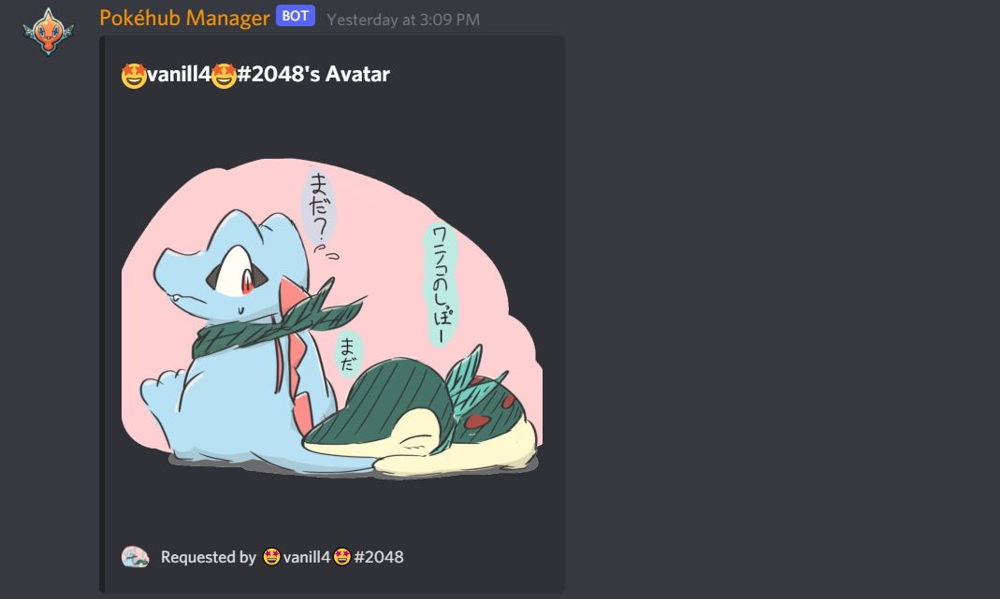
</picture>

Pokedex entry of a pokemon  ```.dex <Pokemon name>``` </br>
<picture>
  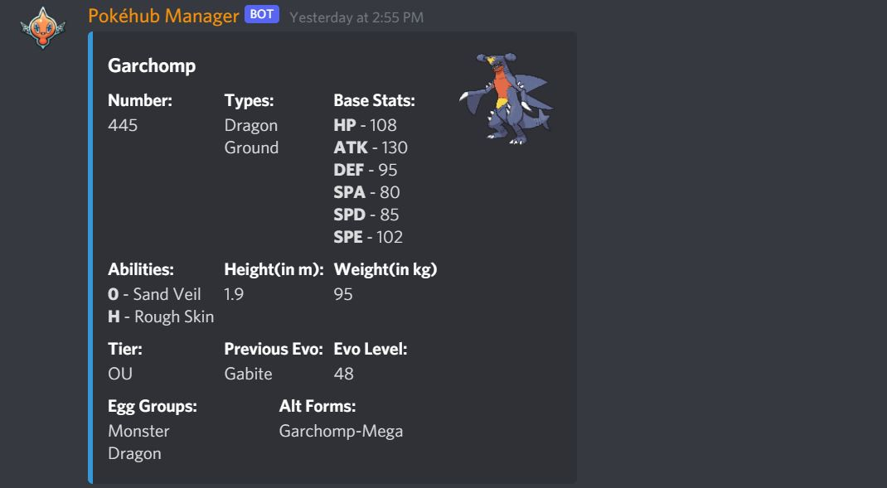
</picture>

Competitive pokemon sets fetched from Smogon ```sets <Pokemon name>``` </br>
<picture>
  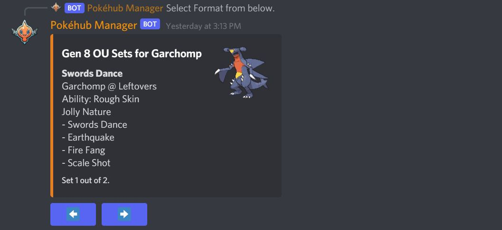
</picture>

Pokemon weakness based on typing ```.weak <Pokemon name>``` </br>
<picture>
  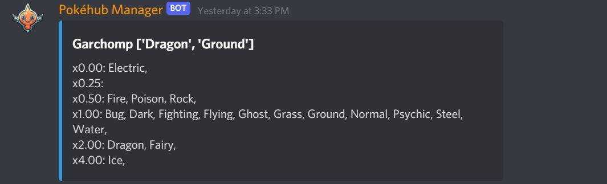
</picture>

Learnset of Pokemon (all moves that can be learned) ```.learnset <Pokemon name>``` </br>
<picture>
  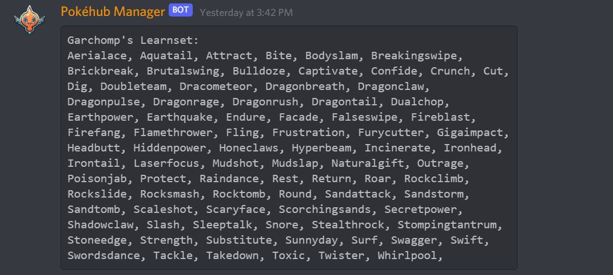
</picture>
